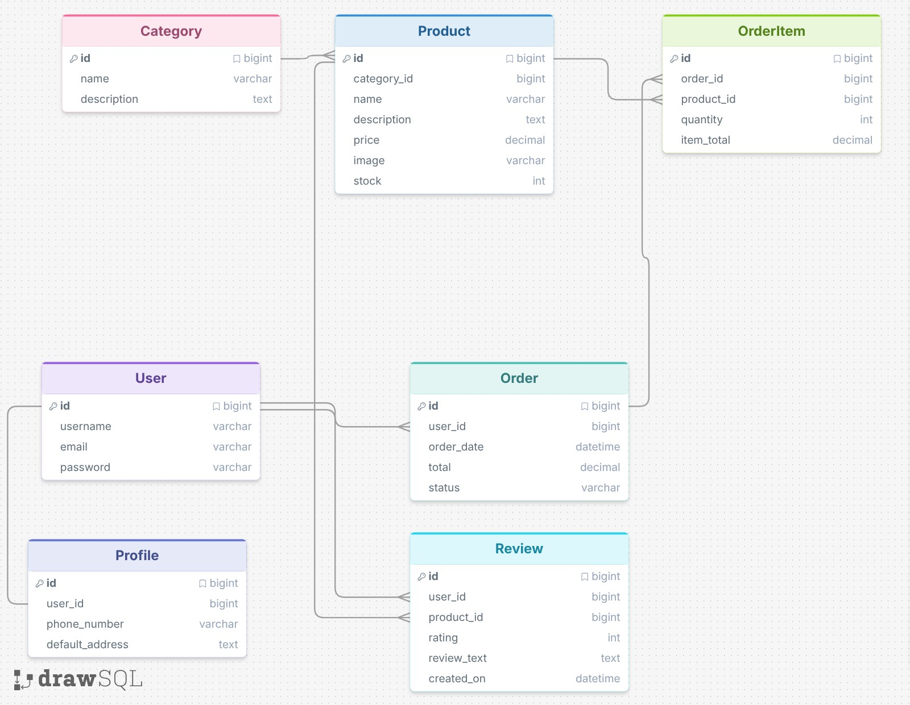

# TechForge
## Table of Contents 
- [Introduction to TechForge](#introduction-to-techforge)
- [Project Purpose](#project-purpose)
- [Target Audience](#target-audience)
- [MoSCoW Methodology](#moscow-methodology)
- [User Stories](#user-stories)
- [User Experience(UX)](#user-experience-ux)
- [Design and Planning](#design-and-planning)
- [Database Schema](#database-schema)
- [Features](#features)

## Introduction to TechForge
TechForge is a web-based e-commerce application. This app was developed using Django framework which allows users to login to the app, browse their desired tech products, all through a simple and user-friendly browsing menu. 

### Product Categories
TechForge is designed to provide users with access to a digital shop for the most popular tech products. Those being:
* Desktop Computers
* Laptops
* Tablets
* Mobile devices 
* Consoles
* Accessories

### User Experience

When accessing the website, users will be greeted with the TechForge homepage, where they can browse the listed categories above via the navigation menu. TechForge provides a structured, yet easy to use shopping experience, allowing users to add items to their basket, edit how many of said item they wish to purchase, and remove items they no longer wish to buy. Once they are done, they proceed through to the checkout page. To make a purchase, users must create an account, the place to do so is with the login button at the top of the page.

### E-Commerce Functionality
A key feature of TechForge is the e-commerce functionality. As users can add items to their basket, review the items and make adjustments before purchasing, and complete the transaction through an online payment system. With requiring users to log into their own account, their basket, order history, and details are linked to their individual accounts, ensuring data is secure and private.

### User Profiles

TechForge has personal profiles, in which users can view their pending orders, order history, and leave reviews. 

### Full-Stack Development Features
TechForge displays CRUD functionality, database design, user authentication, form validation, payment processing, and full-stack development concepts. This is to provide a modern online tech store, all from the comfort of the Django framework.

### Primary Goal
The main goal of TechForge is to provide users with a simple, secure, and  modern tech shop, allowing them to browse tech products, manage their shopping basket, and complete transactions through an easy-to-use platform.

## Project Purpose
TechForge focuses on bringing simplicity back into online shopping. This is achieved by removing unnecessary advertisements, promotional pop-ups and complex user interfaces, leading to a terrible UX. This application allows users to simply browse through the store stress-free, as they know exactly what they are getting. 

## Target Audience

The target audience for TechForge is anyone looking to purchase tech products. The app is not designed with a specific section in mind, for example gamers. TechForge will have something for anyone, creating a diverse portfolio of customers. While other shops use heavy advertisement and promos, TechForge forgoes all of that, to create a stress-free environment. 

Whether you are a student looking for a laptop or tablet, a gamer looking for a console or gaming PC, or someone in desperate need of a printer to print out their travel insurance, TechForge has something for their needs. This means it should appeal to a broader audience regardless of their tech knowledge or prior online shopping experience.

## MoSCoW Methodology 
For this project, I used the MoSCoW methodology to prioritise certain features throughout the development of the app. This approach was split up into three sections: Must Have, Should Have, Could Have, and Won't Have. This helped ensure that functionality was completed first, before adding extra content, making the scope of the project manageable.

## User Stories

### Must Have

#### User Registration

As a: User

I want to: Create an account on the login page.

So that: I can access the rest of the shop and purchase products

Acceptance Criteria:

* User can create an account.
* Users must provide valid information such as email address, and password. 
* Once account has been created, users can login. 
* Invalid details prompts an error message.
* Authorised users have access to the TechForge store.

#### User Login
As a: User

I want to:  Log into the account I have made.

So that:  I can acccess the TechForge shop and my saved account info.

Acceptance Criteria:
* Using valid information, such as email, users can log into their account.
* If user enters incorrect information, an error message appears.
* Users that are logged in can access TechForge.
* Additionally, users that are logged in can access their personal profile.
* Users are only logged out when they click the logout button.

#### User Logout 

As a: User

I want to: Log out of my TechForge account.

So that: My TechForge account is secure when I am finished. 

Acceptance Criteria:
* Users that are logged in can successfully log out.
* After logging out, users are redirected.
* When users are logged out, they no longer have access to TechForge.
* To regain access to TechForge, users have to login again. 
* When a user logs out, they will see a confirmation message.

#### Browse Product Categories

As a: User

I want to: Browse the various product categories.

So that: I can find the products I am interesting in browsing/purchasing.

Acceptance Criteria:
* Users will be able to see all product categories.
* In the navigation bar, categories are clearly displayed.
* Selecting a category takes the users to the specific page for that category. 
* Users will have no issues quickly navigating between categories.
* Only products belonging to that category are displayed. For example, iPhone 17 only belongs to mobile devices. 

#### View Products 

As a: User

I want to: view all available products TechForge has to offer.

So that: I can browse all available products before making purchase.

Acceptance Criteria:
* Users can see every product. 
* Products display important information, such as an image, the name of the item, and its price. 
* The layout for the products is clear. 
* Users can browse products within selected category, not displaying unrelated products. 
* Users have access to additional info if required. 

#### View Product Details

As a: User

I want to: View detailed info about a product

So that: I can decide what to purchase.

Acceptance Criteria:
* Clicking on the product brings up additional information. 
* Product info includes image of product, name, the category its in, and price. 
* Product display is easy to read. 
* Users can add the product to their basket from the product page. 
* Users have an east way of navigating back to the category page. 

#### Add Product to Basket 

As a: User 

I want to: Add products to my shopping basket. 

So that: I can purchase them when its time to checkout.

Acceptance Criteria:
* Users can successfully add products to their basket.
* Users can adjust the quantity for the items in their basket. If they want more than one laptop, they can click the button to add another. 
* When products are added to the basket, they display immediately. 
* Users can see the basket total price, and basket number has increased the second they add another product. 

#### Update Basket Quantity 

As a: User

I want to: Update the quantity of a product in my basket 

So that: my order can be updated before checking out.

Acceptance Criteria:
* Users can increase the number of products in the basket.
* Users can decrease the number of products in the basket.
* No number can go below one.
* When products are increased or decreased, basket total updates immediately. 

#### Remove Product from Basket

As a: User

I want to: Remove any product I want from the basket. 

So that: the items I no longer wish to buy are removed.

Acceptance Criteria:
* Users can completely remove products from the basket. 
* Removed items no longer appears in the basket.
* The total price of the basket adjusts when an item is removed. 
* Users can continue shopping after an item has been removed. 
* Users can re-add the product later if they change their mind.

#### Checkout 

As a: User

I want to: Complete my session through the checkout page.

So that: I can place an order on the products I selected.

Acceptance Criteria:
* Users can review basket before going to checkout.
* Users must provide all required checkout information.
* Users can complete the payment process through the online payment system. 
* When a successful payment is made, an order record is created. 
* Users receive confirmation that their order has been made successfully.
* Unsucessful payments prompts an error message.

#### View Order History 

As a: User 

I want to: view my order history.

So that: I can keep track of my orders and their details.

Acceptance Criteria:
* Users can see a full historic record of their orders.
* Users can view details of a specific order.
* Users can only see orders from their account, not other people.
* Order information includes the order id, the products, their quantities, prices, and the date of order. 
* Users have access to their order history via their profile page. 

#### Leave Product Reviews

As a: User

I want to: Leave reviews of the products I purchased.

So that: I can give my input and express my thoughts on the products.

Acceptance Criteria:
* Logged in users can leave reviews.
* Users can provide a rating and a review.
* Reviews are displayed on the product page. 
* Users can edit their own reviews at any time. 
* Users can delete their reviews.
* Users do not have access to editing or deleting reviews made by others. 

### Should Have
#### Product Search
As a: User

I want to: Search for products in a search bar

So that: I can quickly find the product I am after.

Acceptance Criteria:
* Users can search for the item they want in a search bar.
* Relevant products displayed after product search.
* App promps user if no products match the name.
* Users can continue browsing after searching for a product.

#### Store Delivery Information 
As a: User

I want to: Save my delivery info to my personal profile.

So that: I don't need to repeatedly enter it during checkout.

Acceptance Criteria:
* Users can save their info within their personal profiles.
* Saved information automatically appears when users are on checkout page.
* Users have the option to update their saved information.
* Only account owner has access to their private information.

#### Sort Products 

As a: User

I want to: Sort products by different criteria

So that: Browsing becomes easier. 

Acceptance Criteria:
* Users can sort by price.
* Users can sort products alphabetically.
* Product display changes when user sorts.
* Users can change sorting options at any time during their session.

#### View Pending Orders

As a: User

I want to: View my pending orders separately from past orders.

So that: I can easily track the products I am waiting for.

Acceptance Criteria:
* Users can view pending orders on their profile page.
* Pending orders will display basic order info. 
* Users can tell the difference between a pending order and a completed one.
* Users can only view orders linked to their account. 

### Could Have
#### Wishlist 
As a: User

I want to: Save products for future purchase

So that: Time can be saved browsing for the same items.

Acceptance Criteria:
* Items appear on the save for later page 
* Users can press the love heart symbol to save a product for later.
* Wishlist is exclusive to each users personal profile. 

#### Dark Mode 
As a: User

I want to: Switch the colour scheme from light mode to dark mode.

So that: I can view TechForge is different lighting environments.

Acceptance Criteria:
* Users can switch between the two modes via a button. 
* Selected mode is applied on every TechForge page.
* User's mode preference is saved for future visits to TechForge.
* All text, buttons, and nav bar remains readable in both modes.
### Won't Have
* Live text support
* Product comparison tool
* Ai-powered product recommendations
* Subscription services
* International shipping support
* Crypto payment options 

## User Experience (UX)
### User Journey
Below details the user journey for both a first time visitor, and a returning visitor and how they will both interact with the application. 

#### First Time User
1. Visits the homepage
2. Browses various products and respective categories
3. Creates an account via the login page
4. Logs into the application
5. Gains access to the TechForge store
6. Browses product details and prices
7. Adds chosen products to their basket
8. Proceeds to checkout to complete purchase

#### Returning User
1. Logs into their TechForge account
2. Access the TechForge store
3. Browses product details and prices 
4. Adds chosen products to their basket
5. If needed, updates basket to amend their order
6. Completes checkout 
7. Reviews order history via their profile 
8. Leaves review on previous product purchases (optional)

### UX Goals
With TechForge, the primary goal is to create a stress-free online shopping experience that allows users to browse and quickly purchase products without all of the extra distractions you often see on shopping sites. 

TechForge focusses on: 
* Simplicity: A clean and easy-to read design that is easy to navigate.
* Clarity: Products, menu buttons, images, and more are displayed clearly and are visibly organised. 
* Effiency: Users can quickly find what they are looking for, proceed to checkout, and pay for their items in a matter of minutes. 
* Trust: Users are welcomed to a transparent experience, free of advertisements, promotional pop-ups, and continuous discount messages. 

The aim of TechForge is to free the users of distractions, focussing solely on their task, which is browsing and potentially purchasing products.
### Accessibility and Usability 

Usability and simplicity was at the core when developing the TechForge application. This app focusses on a straightforward shopping experience, allowing the user to browse products without any distractions.

The interface uses a clear and consistent layout, ensuring that the users can easily nevagiate between the login page, the main menu, and the respective category pages quickly and efficiently. The navigation bar is clear and tells the user exactly what they need to know, so that they can get on with purchasing their desired product quickly. 

Validation is also a key feature of this application, with forms throughout the store, ensisting customers adhere to the rules of the validation. For example, when creating an account with TechForge, customers must use a real email address so that we can verify the user, otherwise an error message will appear, asking the user to provide a valid email. 

Have you ever shopped on a lower tier application like Temu, that is riddled with advertisements, scams, and uneccessary information that distracts the user from their objective -- who wants to spin a wheel when they are trying to shop for trainers! 

Lastly, user accounts are protected through authentication, and those accounts can only be accessed by them. The checkout system uses a secure payment system, ensuring their finances are handled with the best care. 

## Design and Planning 
During the design and planning phase on the TechForge application, I created wireframes using Figma to give me the foundations and the vision of what the store will look like. The wireframes were used to map out the layout, clear navigation, and uncluttered pages. 

Below is an image for the following wireframes: 
* Login Page
* Home Page
* Desktop PC 
* Laptop 
* Mobile Devices 
* Tablet 
* Gaming Consoles
* Accessories 
* Checkout 

## Database Schema

### Entity Relationship Diagram
The ERD below reflects how the application will function and the journey that the user will go on. The diagram showcases that users can create an account, browse the various products and their respective category pages, add those products to their basket, complete a secure checkout, and leave a review of the various products they purchased. 

### Category Model
The category model separates the different products into their respective categories. For example, a Dell Laptop will only be in the Laptop category, it won't appear anywhere else. This helps streamline navigation as users can quickly locate the products they wish to purchase. 
### Product Model
The product model is where all the information regarding the products available to purchase in the store is placed. Product name, price, description, image, and stock available makes up one product in the store. 
### Profile Model
The profile model is an extension of Django's built-in model to help store personal information about the user such as phone number and address. Each user on TechForge has one profile, highlighting the one-to-one relationship between the user and profile models. 
### Order Model
When a user completes an order, that information is stored in the order model. The information includes which customer placed the order, the date in which the order took place, the total basket price of the order, and the status of the order, for example, out for delivery. Additionally, the order model allows users to view their order history, enabling TechForge to maintain a record of all completed orders through the checkout system. One user can have many orders, highlighting the one-to-many relationship.
### Order Item Model
The order item model is the bright between the order, and the product models themselves. This model stores information such as which products are part of the model. For example, one order contains an Xbox One X, a new controller, and a Razer headset. Other information included is the quantity of each item purchases, and the cost of that specific product. The relationship highlighted is one order can have multiple products. 
### Review Model
The review model allows users to leave ratings from a previous order. The review includes a rating, and an optional comment on the product, or several products. These reviews are valuable to browsing customers. If an item, such as an Xbox One X, has multiple 5 star ratings, the browsing user is more inclined to pick this product up. Each review is linked to both the user, and a product. One user can create many reviews, and one product can have mutliple reviews. 
### Database Relationships
The database schema for TechForge comprises of several relationships that helps support the efficiency and functionality of the application. Below are the relationships for TechForge:
* One category can contain many products
* Each product belongs to one specific category
* One user has only one profile
* One user can create many orders
* Each order belongs to one specific user
* One order can contain many items
* Each order item belongs to one order
* One product can appear in many order items
* Once user can create many revies
* Each review belongs to one user
* One product can have many reviews
* Each review belongs to one product 

## Features 

### User Registration 

### User Login

### User Logout 

### Product Categories

### Product Browsing 

### Product Details 

### Shopping Basket

### Basket Management

### Secure Checkout 

### Order History 

### Product Reviews 

### User Profiles